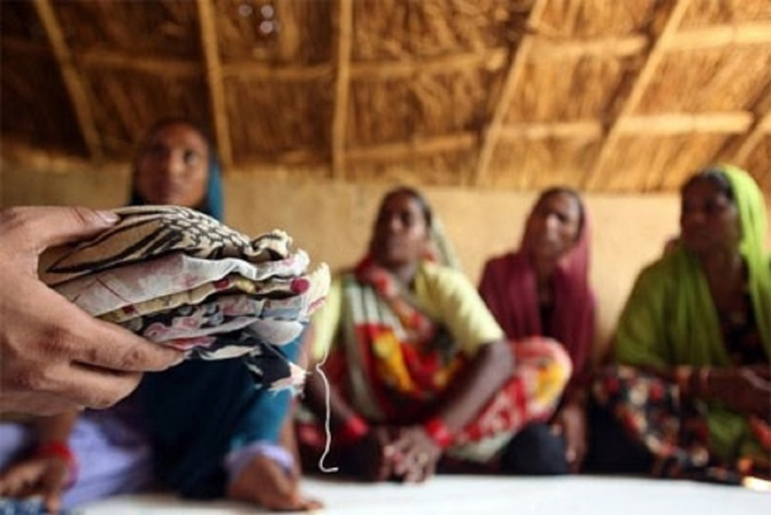
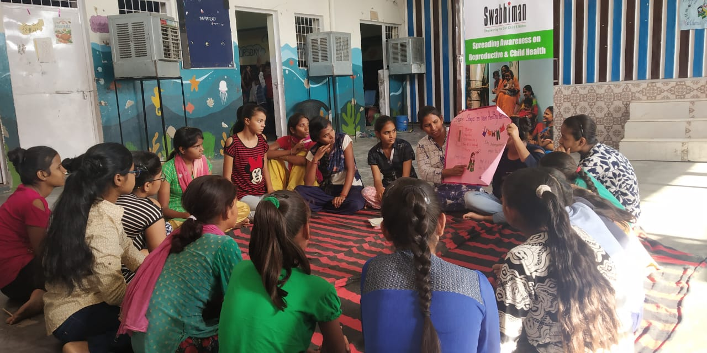

# MH NEPAL

## Overview

This project focuses on investing in menstrual health from a global perspective. It aims to highlight the importance of menstrual health, key challenges, and strategic actions to address these challenges.


### Screenshots

Here are some screenshots of the project:


*Homepage displaying the importance of menstrual health.*


*Impact section showcasing the situation in rural Nepal.*


*Illustration of key challenges faced in menstrual health.*

## Features

- **Homepage**: Introduction to the project's focus on menstrual health.
- **About Section**: Discusses the importance of menstrual health.
- **Key Challenges Section**: Lists the main challenges faced.
- **Impact Section**: Highlights the impact in rural Nepal.
- **Strategic Actions**: Five strategic actions to improve menstrual health.
- **Contact Form**: Allows users to get in touch.
- **FAQ Section**: Answers to frequently asked questions.

## Installation

To run this project locally, follow these steps:

1. Clone the repository:
    ```bash
    git clone https://github.com/your-username/your-repository.git
    ```
2. Navigate into the project directory:
    ```bash
    cd your-repository
    ```
3. Open `index.html` in your browser to view the project.

## Usage

1. Open the `index.html` file in a web browser.
2. Navigate through the sections to view the content.

## Contributing

If you want to contribute to this project, please follow these steps:

1. Fork the repository.
2. Create a new branch for your changes:
    ```bash
    git checkout -b feature-branch
    ```
3. Commit your changes:
    ```bash
    git commit -am 'Add new feature'
    ```
4. Push to the branch:
    ```bash
    git push origin feature-branch
    ```
5. Create a new Pull Request.

## License

This project is licensed under the MIT License - see the [LICENSE](LICENSE) file for details.

## Acknowledgements

- Special thanks to the contributors and libraries used in this project.

